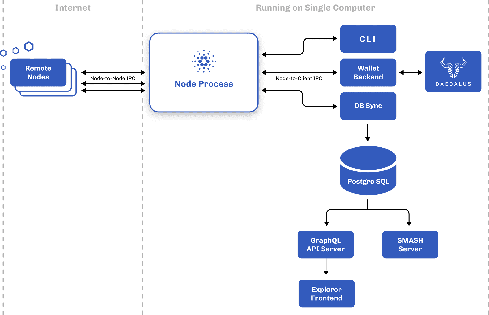
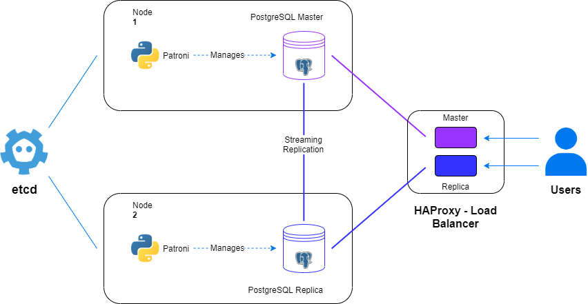

# Cardano-deployment

## Kiến trúc

### 1. Kiến trúc tổng quan



### 2. Dataflow giữa các thành phần

Cardano Node
- Vai trò: Đồng bộ blockchain từ Cardano Network.
- Dữ liệu: Nhận block mới, xác thực và xử lý giao dịch.
- Output: Cung cấp dữ liệu cho Cardano DB Sync.

Cardano DB Sync
- Vai trò: Chuyển đổi dữ liệu blockchain sang dạng có cấu trúc.
- Dữ liệu: Lấy block, giao dịch, UTXO từ Cardano Node.
- Output: Lưu dữ liệu vào PostgreSQL DB để hỗ trợ truy vấn.

PostgreSQL DB
- Vai trò: Lưu trữ dữ liệu blockchain dưới dạng cơ sở dữ liệu quan hệ.
- Dữ liệu: Giao dịch, địa chỉ, stake pools, metadata...
- Output: Cung cấp dữ liệu cho ứng dụng và Mithril.

Mithril
- Vai trò: Tạo snapshot để giúp khởi động nhanh Cardano Node mới.
- Dữ liệu: Trích xuất trạng thái blockchain từ PostgreSQL DB.
- Output: Tạo và xuất bản Mithril Snapshot.

Fast Bootstrap từ Mithril Snapshot
- Cardano Node mới tải snapshot từ Mithril.
- Sau khi khôi phục, node tiếp tục đồng bộ phần dữ liệu còn thiếu từ Cardano Network.

### 3. Demo kết quả thực hiện

3.1 Viết manifest triển khai PostgreSQL DB 

File manifest: `cardano-db.yml`

Kết quả thực hiện

```
PS C:\Users\Max\cardano-deployment> kubectl get pods -n cardano
NAME                            READY   STATUS    RESTARTS      AGE
postgres-7cdc69dff7-m7f6v       1/1     Running   2 (45m ago)   11h
```

Kiểm tra log database

```
2025-03-23 22:58:55 2025-03-23 15:58:55.207 UTC [1] LOG:  starting PostgreSQL 17.2 on x86_64-pc-linux-musl, compiled by gcc (Alpine 14.2.0) 14.2.0, 64-bit
2025-03-23 22:58:55 2025-03-23 15:58:55.208 UTC [1] LOG:  listening on IPv4 address "0.0.0.0", port 5432
2025-03-23 22:58:55 2025-03-23 15:58:55.208 UTC [1] LOG:  listening on IPv6 address "::", port 5432
2025-03-23 22:58:55 2025-03-23 15:58:55.259 UTC [1] LOG:  listening on Unix socket "/var/run/postgresql/.s.PGSQL.5432"
2025-03-23 22:58:55 2025-03-23 15:58:55.287 UTC [28] LOG:  database system was interrupted; last known up at 2025-03-23 08:24:43 UTC
2025-03-23 22:58:56 2025-03-23 15:58:56.797 UTC [28] LOG:  database system was not properly shut down; automatic recovery in progress
2025-03-23 22:58:56 2025-03-23 15:58:56.802 UTC [28] LOG:  redo starts at 2/72BC9030
2025-03-23 22:58:57 2025-03-23 15:58:57.898 UTC [28] LOG:  invalid record length at 2/7BDF7480: expected at least 24, got 0
2025-03-23 22:58:57 2025-03-23 15:58:57.898 UTC [28] LOG:  redo done at 2/7BDF7448 system usage: CPU: user: 0.51 s, system: 0.36 s, elapsed: 1.09 s
2025-03-23 22:58:57 2025-03-23 15:58:57.907 UTC [26] LOG:  checkpoint starting: end-of-recovery immediate wait
2025-03-23 22:58:58 2025-03-23 15:58:58.419 UTC [26] LOG:  checkpoint complete: wrote 16236 buffers (99.1%); 0 WAL file(s) added, 9 removed, 0 recycled; write=0.295 s, sync=0.180 s, total=0.514 s; sync files=176, longest=0.057 s, average=0.002 s; distance=149689 kB, estimate=149689 kB; lsn=2/7BDF7480, redo lsn=2/7BDF7480
2025-03-23 22:58:58 2025-03-23 15:58:58.433 UTC [1] LOG:  database system is ready to accept connections
```

Kiểm tra dữ liệu database và cấu hình healthcheck đảm bảo database sẵn sàng RW dữ liệu

```
/ # psql -h 0.0.0.0 -U postgres
psql (17.2)
Type "help" for help.

postgres=# \l
                                                    List of databases
   Name    |  Owner   | Encoding | Locale Provider |  Collate   |   Ctype    | Locale | ICU Rules |   Access privileges   
-----------+----------+----------+-----------------+------------+------------+--------+-----------+-----------------------
 example_db | postgres | UTF8     | libc            | en_US.utf8 | en_US.utf8 |        |           | 
 postgres  | postgres | UTF8     | libc            | en_US.utf8 | en_US.utf8 |        |           | 
 template0 | postgres | UTF8     | libc            | en_US.utf8 | en_US.utf8 |        |           | =c/postgres          +
           |          |          |                 |            |            |        |           | postgres=CTc/postgres
 template1 | postgres | UTF8     | libc            | en_US.utf8 | en_US.utf8 |        |           | =c/postgres          +
           |          |          |                 |            |            |        |           | postgres=CTc/postgres
(4 rows)

postgres=# 
```

3.2 Viết manifest triển khai Cardano Node

File manifest: `cardano-node.yml`

Kết quả thực hiện

```
PS C:\Users\Max\cardano-deployment> kubectl get pods -n cardano
NAME                            READY   STATUS    RESTARTS      AGE
cardano-node-59bdbdd789-ff9nv   1/1     Running   0             28m
postgres-7cdc69dff7-m7f6v       1/1     Running   2 (45m ago)   11h
```

Kiểm tra log cardano-node

```
2025-03-23 23:53:19 [cardano-:cardano.node.Mempool:Info:41] [2025-03-23 16:53:19.80 UTC] fromList [("enclosingTime",Object (fromList [("tag",String "RisingEdge")])),("kind",String "TraceMempoolSynced")]
2025-03-23 23:53:19 [cardano-:cardano.node.Mempool:Info:41] [2025-03-23 16:53:19.80 UTC] fromList [("enclosingTime",Object (fromList [("contents",Number 1.8101e-4),("tag",String "FallingEdgeWith")])),("kind",String "TraceMempoolSynced")]
2025-03-23 23:53:19 [cardano-:cardano.node.ChainDB:Notice:33] [2025-03-23 16:53:19.80 UTC] Chain extended, new tip: e405ebee64f184c4271413f2db516960c9d072773d0a02a22cf9437d00679ca2 at slot 17178624
```

3.3 Viết manifest triển khai Cardano DB Sync

File manifest: `cardano-db-sync.yml`

Kết quả thực hiện

```
PS C:\Users\Max\cardano-deployment> kubectl get pods -n cardano
NAME                            READY   STATUS    RESTARTS      AGE
cardano-node-59bdbdd789-ff9nv   1/1     Running   0             28m
cardano-sync-754c9b894c-zfk46   1/1     Running   0             25m
postgres-7cdc69dff7-m7f6v       1/1     Running   2 (45m ago)   11h
```

Kiểm tra log cardano-db-sync đảm bảo kết cardano-db-sync đã detect được node.socket từ cardano-node


```
2025-03-23 23:18:35 /run/secrets
2025-03-23 23:18:35 Generating PGPASS file
2025-03-23 23:18:35 Connecting to network: preprod
2025-03-23 23:18:35 [db-sync-node:Info:6] [2025-03-23 16:18:35.98 UTC] Version number: 13.6.0.5
2025-03-23 23:18:35 [db-sync-node:Info:6] [2025-03-23 16:18:35.98 UTC] Git hash: 0000000000000000000000000000000000000000
...
2025-03-23 23:18:39 [db-sync-node:Info:83] [2025-03-23 16:18:39.05 UTC] Connecting to node via "/node-ipc/node.socket"
2025-03-23 23:18:39 [db-sync-node.Subscription:Notice:89] [2025-03-23 16:18:39.05 UTC] Identity Starting Subscription Worker, valency 1
2025-03-23 23:18:39 [db-sync-node.Subscription:Notice:90] [2025-03-23 16:18:39.05 UTC] Identity Connection Attempt Start, destination LocalAddress "/node-ipc/node.socket"
2025-03-23 23:18:39 [db-sync-node.Subscription:Notice:90] [2025-03-23 16:18:39.05 UTC] Identity Connection Attempt End, destination LocalAddress "/node-ipc/node.socket" outcome: ConnectSuccessLast
2025-03-23 23:18:39 [db-sync-node.Handshake:Info:90] [2025-03-23 16:18:39.05 UTC] WithMuxBearer (ConnectionId {localAddress = LocalAddress "", remoteAddress = LocalAddress "/ipc/node.socket"}) Send (ClientAgency TokPropose,MsgProposeVersions (fromList [(NodeToClientV_9,TInt 1),(NodeToClientV_10,TInt 1),(NodeToClientV_11,TInt 1),(NodeToClientV_12,TInt 1),(NodeToClientV_13,TInt 1),(NodeToClientV_14,TInt 1),(NodeToClientV_15,TList [TInt 1,TBool False]),(NodeToClientV_16,TList [TInt 1,TBool False]),(NodeToClientV_17,TList [TInt 1,TBool False]),(NodeToClientV_18,TList [TInt 1,TBool False])]))
2025-03-23 23:18:39 [db-sync-node:Info:85] [2025-03-23 16:18:39.05 UTC] Running Offchain Pool fetch thread
```

3.4 Viết manifest triển khai Mithril

File manifest triển khai mithril: `bootstrap-mithril.yml`
File manifest triển khai cardano-node mới: `cardano-node-bootstrap.yml`

Kết quả thực hiện

```
PS C:\Users\Max\cardano-deployment> kubectl get job -n cardano
NAME             STATUS    COMPLETIONS   DURATION   AGE
mithril-client   Running   0/1           3s         3s 
```

Kiểm tra log job thực hiện 

```
2025-03-23 23:59:24 mithril-client cardano-db snapshot list
2025-03-23 23:59:26 +-------+-----------+---------+------------------------------------------------------------------+----------+-----------+-----------------------------------+
2025-03-23 23:59:26 | Epoch | Immutable | Network | Digest                                                           |     Size | Locations |                           Created |
2025-03-23 23:59:26 +-------+-----------+---------+------------------------------------------------------------------+----------+-----------+-----------------------------------+
2025-03-23 23:59:26 | 205   | 4027      | preprod | e600d4c37d87679ac67141aae38499e2bf17dd34b23f64c597c7d1cb7ae67fd1 | 2.85 GiB | 1         | 2025-03-23 15:21:04.615285744 UTC |
2025-03-23 23:59:26 +-------+-----------+---------+------------------------------------------------------------------+----------+-----------+-----------------------------------+
2025-03-23 23:59:26 | 205   | 4026      | preprod | efd8f19c0ec46cc43796a87c624d4f7e70f0fd2c28d3080cda271016938d1cf7 | 2.85 GiB | 1         | 2025-03-23 09:25:13.505187016 UTC |
2025-03-23 23:59:26 +-------+-----------+---------+------------------------------------------------------------------+----------+-----------+-----------------------------------+
2025-03-23 23:59:26 +-------+-----------+---------+------------------------------------------------------------------+----------+-----------+-----------------------------------+
2025-03-23 23:59:26 +-------+-----------+---------+------------------------------------------------------------------+----------+-----------+-----------------------------------+
2025-03-23 23:59:27 mithril-client cardano-db snapshot show ID
2025-03-23 23:59:28 +-----------------------+------------------------------------------------------------------------------------------------------------------------------------------------------------------------------------------------------------+
2025-03-23 23:59:28 | Epoch                 | 205                                                                                                                                                                                                        |
2025-03-23 23:59:28 +-----------------------+------------------------------------------------------------------------------------------------------------------------------------------------------------------------------------------------------------+
2025-03-23 23:59:28 | Immutable File Number | 4025                                                                                                                                                                                                       |
2025-03-23 23:59:28 +-----------------------+------------------------------------------------------------------------------------------------------------------------------------------------------------------------------------------------------------+
2025-03-23 23:59:28 | Network               | preprod                                                                                                                                                                                                    |
2025-03-23 23:59:28 +-----------------------+------------------------------------------------------------------------------------------------------------------------------------------------------------------------------------------------------------+
2025-03-23 23:59:28 | Digest                | 7bcce7edef71d135da9cb6a282beb60b90031b7c8bed22b6537e0ce3f29aa981                                                                                                                                           |
2025-03-23 23:59:28 +-----------------------+------------------------------------------------------------------------------------------------------------------------------------------------------------------------------------------------------------+
2025-03-23 23:59:28 | Size                  | 2.85 GiB                                                                                                                                                                                                   |
2025-03-23 23:59:28 +-----------------------+------------------------------------------------------------------------------------------------------------------------------------------------------------------------------------------------------------+
2025-03-23 23:59:28 | Cardano node version  | 10.1.4                                                                                                                                                                                                     |
2025-03-23 23:59:28 +-----------------------+------------------------------------------------------------------------------------------------------------------------------------------------------------------------------------------------------------+
2025-03-23 23:59:28 | Location              | https://storage.googleapis.com/cdn.aggregator.release-preprod.api.mithril.network/cardano-immutable-files-full/preprod-e205-i4025.7bcce7edef71d135da9cb6a282beb60b90031b7c8bed22b6537e0ce3f29aa981.tar.zst |
2025-03-23 23:59:28 +-----------------------+------------------------------------------------------------------------------------------------------------------------------------------------------------------------------------------------------------+
2025-03-23 23:59:28 | Created               | 2025-03-23 02:58:55.175764694 UTC                                                                                                                                                                          |
2025-03-23 23:59:28 +-----------------------+------------------------------------------------------------------------------------------------------------------------------------------------------------------------------------------------------------+
2025-03-23 23:59:28 | Compression Algorithm | Zstandard                                                                                                                                                                                                  |
2025-03-23 23:59:28 +-----------------------+------------------------------------------------------------------------------------------------------------------------------------------------------------------------------------------------------------+
2025-03-23 23:59:28 mithril-client cardano-db download ID
2025-03-24 00:00:39 Error: Can not get download and unpack cardano db for digest: '7bcce7edef71d135da9cb6a282beb60b90031b7c8bed22b6537e0ce3f29aa981'
2025-03-24 00:00:39 
2025-03-24 00:00:39 Caused by:
2025-03-24 00:00:39     0: Download: Could not read from byte stream
2025-03-24 00:00:39     1: error decoding response body
2025-03-24 00:00:39     2: error reading a body from connection
2025-03-24 00:00:39     3: Connection reset by peer (os error 104)
```

Vấn đề tồn đọng:

- Mithril đã lấy thông tin được thông tin các bản snapshot cardano-node network preprod từ Mithril Aggregator nhưng gặp vấn đề khi tải về từ S3 => Tiếp tục rà soát cấu hình, tìm thêm nguyên nhân, thử nghiệm trên các bản snapshot khác trên S3 
- Chưa thử nghiệm bootstrap từ bản snapshot dữ liệu cho cardano-node mới

### 4. Các việc cần làm tiếp theo

4.1 Mở rộng kiến trúc cho Database Postgres đảm bảo tính HA 

**Phương án 1**: Nghiên cứu sử dụng postgres-operator của CNCF

- Link source: https://github.com/cloudnative-pg/cloudnative-pg

Uư điểm:

- Tự động hóa quản lý PostgreSQL
- Hỗ trợ High Availability & Failover tự động
- Dễ dàng triển khai trên Kubernetes
- Dễ mở rộng

Nhược điểm:
- Độ phức tạp cao, cần quản trị được các action của operator tương tác với db
- Hiệu suất có thể bị ảnh hưởng khi triển khai trên k8s thay vì VM/bare-metal
- Khó kiểm soát dữ liệu khi chạy trong Kubernetes
- Khó khăn khi nâng cấp, thay đổi cấu hình

**Phương án 2**: Dựng mô hình HA trực tiếp cho database

Mô hình kiến trúc



- Ứng dụng kết nối đến VIP (Keepalived).
- HAProxy kiểm tra trạng thái PostgreSQL qua Patroni API.
- HAProxy forward kết nối đến PgBouncer/PGPool.
- PgBouncer/PGPool kiểm tra loại truy vấn (đọc/ghi).
  - Nếu là ghi, chuyển đến Leader.
  - Nếu là đọc, có thể load balance giữa các Replicas.
- Patroni kiểm soát replication và failover tự động khi cần.

Ưu điểm:
- High Availability (HA): Nếu PostgreSQL leader down, Patroni tự động failover.
- Load Balancing: HAProxy có thể cân bằng tải giữa replicas.
- Tối ưu kết nối: PgBouncer giúp giảm số lượng kết nối PostgreSQL.
- Scalability: Có thể mở rộng thêm replicas để xử lý nhiều truy vấn đọc hơn.
- Dễ dàng upgrade version, quản lý thay đổi cấu hình,...

Nhược điểm
- Tốn nguồn lực vận hành, quản trị nhiều service

4.2 Triển khai autoscale cho các app stateless

Triển khai metrics-server thực hiện thu thập dữ liệu từ apiserver phục vụ autoscaler theo chiến lược 

Source code: https://github.com/kubernetes-sigs/metrics-server

**Thiết kế phương án autoscale dịch vụ**

Có 3 giải pháp chính để autoscaling pods tùy vào nhu cầu và chiến lược sử dụng cho hợp lý

- HPA (Horizontal Pod Autoscaler): Scale số lượng pod dựa trên CPU, RAM, hoặc custom metrics. Khi workload có thể chạy nhiều pod để xử lý tăng/giảm tải.
- VPA (Vertical Pod Autoscaler): Thay đổi CPU/RAM request & limit của pod. Khi muốn tối ưu tài nguyên mà không cần thay đổi số lượng pod.
- Cluster Autoscaler: Tự động scale số lượng node trong cluster. Khi cluster thiếu tài nguyên để chạy pod mới.
